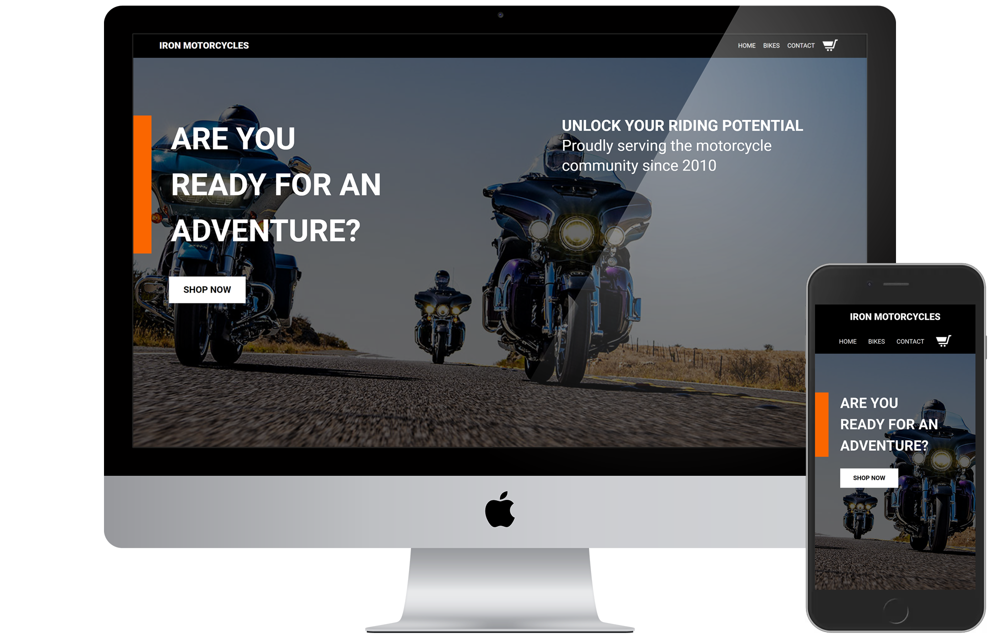

<h1 align="center">Iron Motorcycles</h1>

<p align="center" width="100%">
    
</p>

<h4 align="center">An e-commerce mock of a fictional Harley Davidson Motorcycle retailer - Iron Motorcycles.</h4>
<p align="center"> <a href="https://iron-motorcycles.netlify.app/">View Live >></a></p>

## Features
This app has many features, it comes with:

- A fully responsive website ranging from mobile view to desktop
- A cart menu where the user can see items they have added to the cart as well as their respective prices,
item quantity control, and cart subtotal. All items stored in localStorage for data persistence.
- Dynamic motorcycle category selection
- Contact Page
- Cart checkout page where the user can get a final view of their cart before making a purchase of all items in cart.

## Motivation and Story
This project was a highly anticipated project of mine - being able to create a nice mock of an e-commerce site that had
dynamic page creation and item control was the goal for this project. I had lots of practice with react-router as well as
being exposed to other technologies such as react-scroll, and more react hooks such as useContext. I also ended up using some
functions from the Math object (as well as using other functions) in order to be able to calculate the subtotal of multiple cart
items. Lots of practice with commonly used react tech such as useState and passing props was done throughout the project.

All components were created using functional components.

Figma Mock: https://www.figma.com/file/NL6a8wlfEi2rwZ25Cg95ef/Motorcycle-Shop

## Code Styles
This project follows the [Airbnb JavaScript Style Guide](https://github.com/airbnb/javascript).

Eslint and Prettier were also used in this project.

## Tech Stack
**Built with**
- [React](https://reactjs.org/)
- [Prettier](https://prettier.io/)
- [ESlint](https://eslint.org/)
- [Babel](https://babeljs.io/)
- [Webpack](https://webpack.js.org/)
- [Jest](https://jestjs.io/docs/getting-started)
- [npm](https://www.npmjs.com/)
- [react-testing-library](https://testing-library.com/docs/react-testing-library/intro/)
- [create-react-app](https://create-react-app.dev/)
- [react-responsive](https://www.npmjs.com/package/react-responsive)
- [react-scroll](https://www.npmjs.com/package/react-scroll)
- [uniqid](https://www.npmjs.com/package/uniqid)

## Repository Installation
```
$ git clone git@github.com:ec-rilo/iron-motorcycles.git
```

## Tests
All tests are run using Jest and react-testing-library.

To install Jest please follow the [Getting Started Page](https://jestjs.io/docs/getting-started) on the
Jest website.

To install react-testing-library type `npm install --save-dev @testing-library/dom` in the terminal.
To learn more please read the docs at <a href="https://testing-library.com/docs/react-testing-library/intro/">testing-library.com/react</a>

Please note, if using create-react-app - both Jest and react-testing-library will have been installed for you.

## Credits
I'd like to thank my small community on discord for always supporting my small milestones announcements for this project
and The Odin Project community on discord for having helped me out with hints and feedback whenever I had questions.
I can't thank either group enough for the amount of support that has been given to me.

## Contact
**Edgar Carrillo**
</br>
- [Linkedin](https://www.linkedin.com/in/ecarrillo046/)
- [Github](https://github.com/ec-rilo)


<p align="center">Project created by <a href="https://github.com/ec-rilo">Edgar Carrillo</a></p>
